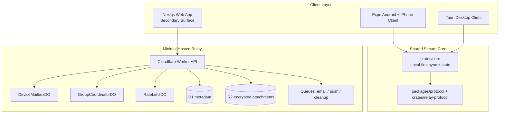

# EmberChamber

<p align="center">
  
</p>

> **Invite-only encrypted messaging for trusted circles.** EmberChamber is being rebuilt as a local-first beta for Android, iPhone, Windows, and Ubuntu with a minimal hosted relay and private email bootstrap.

[](LICENSE)

## Current Direction

EmberChamber is no longer targeting a Telegram-like centralized MVP.

The repo now pivots toward:

- `email magic link + optional passkey` bootstrap auth
- `true E2EE DMs` and `small E2EE groups`
- `invite-only beta access`
- `local-first message history`
- `Cloudflare Workers + Durable Objects + D1 + R2` as the minimal relay
- `Android + iPhone + Windows + Ubuntu + macOS` as the first shipping surfaces

What EmberChamber is not:

- not a public social network
- not a channel/discovery platform in beta
- not phone-number based
- not tied to Google auth
- not “perfect anonymity” or “pure P2P forever”

## Repo Status

Working beta scaffolds now in this repo:

- `apps/relay`: Cloudflare relay/control plane scaffold
- `apps/mobile`: Expo Android and iPhone client scaffold
- `apps/desktop`: Tauri desktop beta shell with bundled local frontend
- `apps/web`: public site plus secondary-but-capable web messaging workspace
- `crates/core`: Rust local-first sync and secure-state scaffold
- `crates/relay-protocol`: canonical Rust relay and envelope contracts
- `packages/protocol`: TypeScript mirror of relay contracts

Legacy prototype paths retained temporarily:

- `apps/api`: Express/Postgres prototype, now legacy
- `infra/docker-compose.yml`: legacy centralized stack
- `services/` and several older Rust scaffolds: not part of the active beta runtime

## Beta Product Scope

Launch beta includes:

- invite-only signup
- email magic-link auth
- optional passkey enrollment later
- web messaging, search, invite review, and settings as a secondary surface
- per-device key registration
- E2EE direct messaging
- E2EE small groups capped at 12 members
- encrypted attachments
- local search on device
- blocking and disclosure-based reporting
- 2-device support

Deferred beyond first beta:

- public-discovery-first growth loops
- large public-community channel strategy
- phone-number identity
- voice/video calling
- server-side search over private content

## Architecture Snapshot



## Auth Model

- Email is private and used only for auth and recovery.
- New beta accounts require an invite token.
- `POST /v1/auth/start` creates a 10-minute magic-link challenge.
- `POST /v1/auth/complete` consumes the link and issues device-bound session tokens.
- Passkeys are scaffolded in the protocol but not yet fully wired in the relay runtime.
- Recovery after total device loss re-establishes device identity and should emit a safety-number change event.

## Relay Model

The relay stores:

- encrypted attachment blobs
- ciphertext message envelopes until ack or expiry
- public key bundles
- account/session/device metadata
- invite and group membership metadata

The relay does not aim to store:

- decrypted DM or group history
- server-side search indexes for private messages
- public contact discovery graphs

## Local Development

### Web app + relay

```bash
npm install
cp .env.example .env
cp apps/web/.env.example apps/web/.env.local
npm run build --workspace=packages/protocol
npm run dev
```

### Relay migrations

```bash
cd apps/relay
npx wrangler d1 migrations apply emberchamber-relay-dev --local
```

### Desktop shell

```bash
npm run dev:desktop
```

### Android and iPhone scaffold

```bash
npm run dev:mobile
```

## Verification Targets

The new beta scaffold should verify cleanly with:

- `npm run build --workspace=packages/protocol`
- `npm run build --workspace=apps/relay`
- `npm run build --workspace=apps/web`
- `npm test --workspace=apps/relay`
- `cargo test -p emberchamber-core -p emberchamber-relay-protocol`
- `cargo check --manifest-path apps/desktop/src-tauri/Cargo.toml`

## Documentation

- Architecture: [`docs/architecture.md`](docs/architecture.md)
- Launch targets: [`docs/launch-targets.md`](docs/launch-targets.md)
- Web app: [`apps/web/README.md`](apps/web/README.md)
- Operator playbook: [`docs/operator-playbook.md`](docs/operator-playbook.md)
- Legacy prototype API spec: [`docs/openapi.yaml`](docs/openapi.yaml)

## Web App

The Next.js app now includes public and authenticated routes.

Public routes:

- `/` for positioning and launch framing
- `/start` for first-time routing
- `/download` for target-platform guidance
- `/privacy` for high-level privacy commitments
- `/beta-terms` for controlled-beta expectations
- `/trust-and-safety` for the anti-abuse boundary model
- `/support` for recovery and reporting guidance
- `/login`, `/register`, and `/auth/complete` for bootstrap auth
- `/invite/[code]` and `/invite/[groupId]/[token]` for invite landing and acceptance

Authenticated web workspace routes:

- `/app` for the web workspace home
- `/app/new-dm` and `/app/chat/[id]` for direct messaging
- `/app/new-group` for group creation
- `/app/new-channel` and `/app/channel/[id]` for lighter-weight channel use
- `/app/search` for workspace search
- `/app/discover` for invite preview and join
- `/app/settings` for account, session, and privacy controls

The web app supports real messaging and account flows, but Android and desktop remain the
preferred primary-use surfaces.
