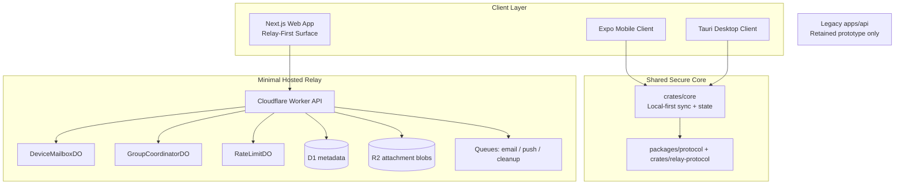

# EmberChamber

<p align="center">
  
</p>

> **Invite-only encrypted messaging for trusted circles.** EmberChamber is being rebuilt as a local-first beta for Android, Windows, Ubuntu, and web with a minimal hosted relay and private email bootstrap. iPhone and macOS remain deferred.

[](LICENSE)

## Current Direction

EmberChamber is no longer targeting a Telegram-like centralized MVP.

The repo now pivots toward:

- `email magic link + optional passkey` bootstrap auth
- `migrating toward true E2EE DMs` and `small E2EE groups`
- `invite-only beta access`
- `local-first message history`
- `Cloudflare Workers + Durable Objects + D1 + R2` as the minimal relay
- `Android + Windows + Ubuntu + web` as the first committed beta surfaces
- `iPhone + macOS` deferred until the first-wave surfaces are stable enough to justify the extra review and reliability work

What EmberChamber is not:

- not a public social network
- not a channel/discovery platform in beta
- not phone-number based
- not tied to Google auth
- not “perfect anonymity” or “pure P2P forever”

## Repo Status

Working beta scaffolds now in this repo:

- `apps/relay`: Cloudflare relay/control plane scaffold
- `apps/mobile`: Expo Android and iPhone client scaffold
- `apps/desktop`: Tauri desktop beta shell with bundled local frontend
- `apps/web`: public site plus secondary-but-capable web messaging workspace
- `crates/core`: Rust local-first sync and secure-state scaffold
- `crates/relay-protocol`: canonical Rust relay and envelope contracts
- `packages/protocol`: TypeScript mirror of relay contracts
- `repo-map.yaml`: machine-readable runtime map for agents and contributors

Legacy prototype paths retained temporarily:

- `apps/api`: Express/Postgres prototype, now legacy
- `infra/docker-compose.yml`: legacy centralized stack
- `services/` and several older Rust scaffolds: archived legacy services, not part of the active beta runtime or the root Cargo workspace

Current implementation reality:

- relay-native bootstrap, sessions, privacy settings, group creation/invites, and signed attachment tickets are live
- the encrypted mailbox and device-bundle path now powers new DM and new device-encrypted group sends across web, Android, and desktop
- new device-encrypted groups keep message bodies and attachment keys off the relay, while legacy relay-hosted groups still exist until each group is migrated
- the web workspace now runs on relay APIs for authenticated messaging, joined-space search, invites, and settings

## Beta Product Direction

The intended beta surface includes:

- adults-only invite-gated access with explicit 18+ affirmation
- invite-only signup
- email magic-link auth
- optional passkey enrollment later
- web messaging, search, invite review, and settings as a secondary surface
- pseudonymous display names and handles as the social identity
- per-device key registration
- ciphertext mailbox delivery for direct messages
- small groups capped at 12 members
- device-encrypted small-group delivery with local device history
- organizer/admin-controlled invites in phase 1
- standard media defaults globally, with stronger per-group protections when organizers opt in
- signed attachment upload/download with private-vault defaults
- local search on device
- blocking and disclosure-based reporting
- 2-device support

Deferred beyond first beta:

- public-discovery-first growth loops
- large public-community channel strategy
- phone-number identity
- voice/video calling
- server-side search over private content

## Architecture Snapshot



## Auth Model

- Email is private and used only for auth and recovery.
- Beta access is adults-only and currently uses a self-attested 18+ confirmation step.
- New beta accounts require a beta invite token or a qualifying group invite.
- `POST /v1/auth/start` creates a 10-minute magic-link challenge.
- `POST /v1/auth/complete` consumes the link and issues device-bound session tokens.
- Passkeys are scaffolded in the protocol but not yet fully wired in the relay runtime.
- Recovery after total device loss still needs a fuller trusted-device flow and safety-change handling.

## Relay Model

The relay stores:

- attachment blobs uploaded through signed tickets
- ciphertext message envelopes until ack
- public key bundles and mailbox metadata
- account/session/device metadata
- invite and group membership metadata
- relay-hosted group thread text and attachment metadata in the current `/v1/groups/*` flow
- ciphertext attachment blobs, signed access metadata, and legacy relay-hosted group history that still needs cleanup after migration

The target end state does not aim to store:

- decrypted DM or group history
- server-side search indexes for private messages
- public contact discovery graphs

## Local Development

First-time setup from the repo root:

```bash
npm run bootstrap
npm run dev
```

`npm run bootstrap` installs root dependencies, creates the default local env files when missing,
builds `packages/protocol`, and seeds the reusable local beta invite after applying local relay
migrations.

### Web app + relay

```bash
npm install
cp .env.example .env
cp apps/web/.env.example apps/web/.env.local
npm run build --workspace=packages/protocol
npm run dev
```

Root workspace scripts and CI use `npm`. The standalone VitePress wiki under `docs/wiki-site`
keeps its own `pnpm` install flow.

### Relay migrations

```bash
cd apps/relay
npx wrangler d1 migrations apply emberchamber-relay-dev --local
```

### Desktop shell

```bash
npm run dev:desktop
```

### Ubuntu local test lane

```bash
npm run ubuntu:ready
```

That prepares the local relay, seeds the reusable `ubuntu-local-test-invite` token, builds and installs the Ubuntu desktop package, and leaves the relay running in a detached `screen` session named `ember-relay`.

When the desktop app opens without a saved relay override, it adopts the local relay automatically and prefills that real local beta invite token for the Ubuntu smoke-test path.

### Android-first mobile scaffold

```bash
npm run dev:mobile
```

## Verification Targets

The new beta scaffold should verify cleanly with:

- `npm run build --workspace=packages/protocol`
- `npm run build --workspace=apps/relay`
- `npm run build --workspace=apps/web`
- `npm test --workspace=apps/relay`
- `cargo test -p emberchamber-core -p emberchamber-relay-protocol`
- `cargo check --manifest-path apps/desktop/src-tauri/Cargo.toml`

For a full active-runtime sweep, run:

- `npm run verify:all`

## Documentation

- Contributing: [`CONTRIBUTING.md`](CONTRIBUTING.md)
- Repo map: [`repo-map.yaml`](repo-map.yaml)
- AI review council: [`llm_council/README.md`](llm_council/README.md)
- Docs index: [`docs/README.md`](docs/README.md)
- Architecture: [`docs/architecture.md`](docs/architecture.md)
- Launch targets: [`docs/launch-targets.md`](docs/launch-targets.md)
- Ubuntu install and test: [`docs/ubuntu-install-and-test.md`](docs/ubuntu-install-and-test.md)
- Roadmap: [`docs/roadmap.md`](docs/roadmap.md)
- Relay API: [`docs/api/relay-http.md`](docs/api/relay-http.md)
- Web app: [`apps/web/README.md`](apps/web/README.md)
- Operator playbook: [`docs/operator-playbook.md`](docs/operator-playbook.md)
- Legacy prototype API spec: [`docs/api/openapi.yaml`](docs/api/openapi.yaml)

## AI Review Council

For non-trivial reviews, audits, or cross-surface changes, use the repo-specific council in `llm_council/`.

From the repo root:

```bash
cp llm_council/templates/review-request.template.yaml review-request.yaml
npm run council:review -- HEAD WORKTREE "current-worktree"
cat recommended-reviewers.txt
```

Use `main HEAD` instead of `HEAD WORKTREE` when you want a committed branch or PR diff instead of the current dirty tree.

## Web App

The Next.js app now includes public and authenticated routes.

Public routes:

- `/` for positioning and launch framing
- `/start` for first-time routing
- `/download` for target-platform guidance
- `/privacy` for high-level privacy commitments
- `/beta-terms` for controlled-beta expectations
- `/trust-and-safety` for the anti-abuse boundary model
- `/support` for recovery and reporting guidance
- `/login`, `/register`, and `/auth/complete` for bootstrap auth
- `/invite/[code]` and `/invite/[groupId]/[token]` for invite landing and acceptance

Authenticated web workspace routes:

- `/app` for the web workspace home
- `/app/new-dm` and `/app/chat/[id]` for direct messaging
- `/app/new-group` for group creation
- `/app/new-community` and `/app/community/[id]` for invite-gated community and room management
- `/app/new-channel` as a bridge to the newer community flow
- `/app/channel/[id]` for the retired legacy-channel notice
- `/app/search` for workspace search
- `/app/discover` for invite preview and join
- `/app/settings` for account, session, and privacy controls

Current backend split:

- relay-native: onboarding, adults-only affirmation, invite landing/preview, DM chat, joined-space search, profile and privacy settings, session review, group creation, community and room management, and invite creation/acceptance
- legacy `apps/api`: retained prototype only, not part of the active authenticated web workspace

The web app remains useful, but Android and desktop are still the preferred primary-use surfaces.
