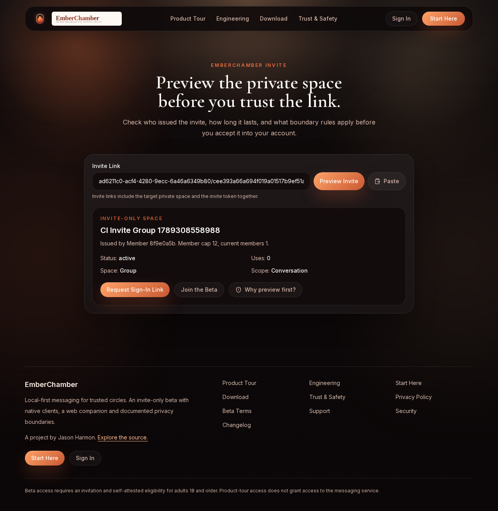
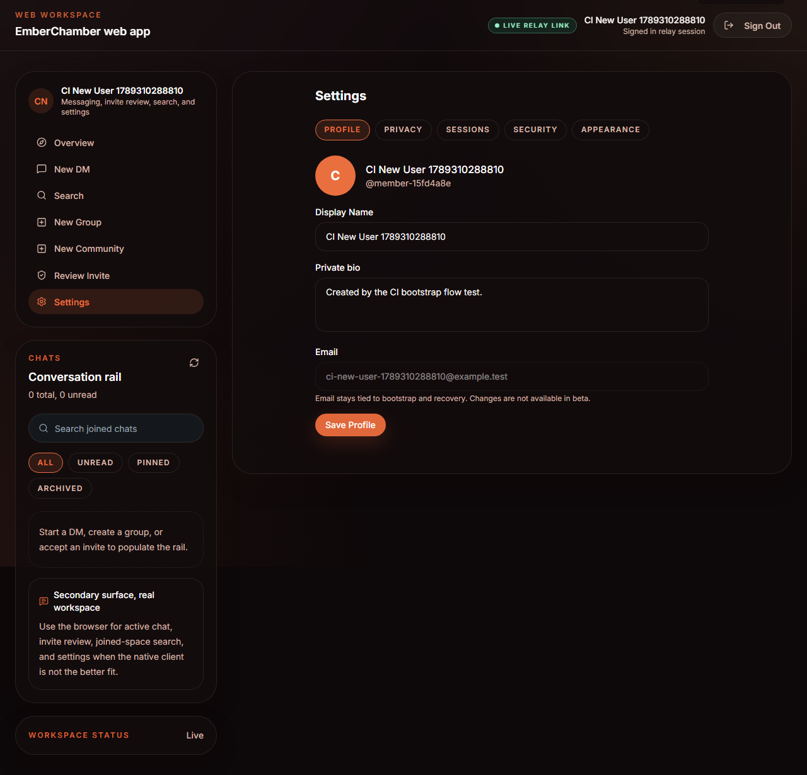
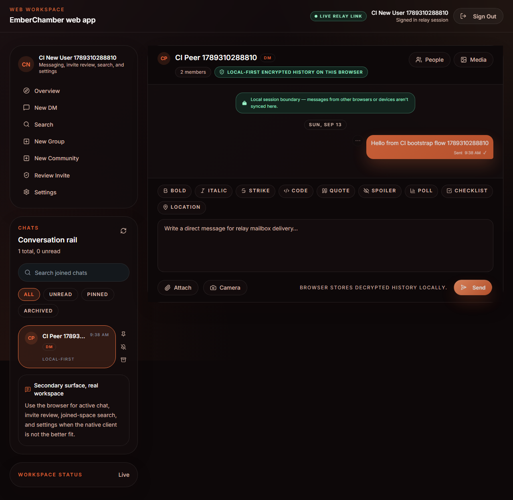
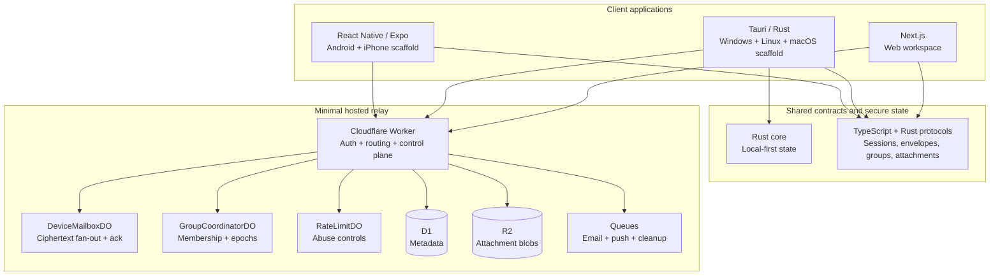

<p align="center">
  
</p>

<p align="center">
  <strong>Cross-platform, local-first encrypted messaging for trusted circles.</strong><br />
  Built with Next.js, React Native / Expo, Tauri / Rust, and Cloudflare Workers, Durable Objects, D1, and R2.
</p>

<p align="center">
  <a href="https://emberchamber.com"><strong>Live web app</strong></a>
  &nbsp;&middot;&nbsp;
  <a href="https://emberchamber.com/download"><strong>Download</strong></a>
  &nbsp;&middot;&nbsp;
  <a href="https://github.com/jhwodchuck/EmberChamber/releases"><strong>Release feed</strong></a>
  &nbsp;&middot;&nbsp;
  <a href="docs/README.md"><strong>Documentation</strong></a>
</p>

<p align="center">
  <a href="https://github.com/jhwodchuck/EmberChamber/actions/workflows/ci-repo-contract.yml"></a>
  <a href="https://github.com/jhwodchuck/EmberChamber/actions/workflows/ci-rust.yml"></a>
  <a href="https://github.com/jhwodchuck/EmberChamber/actions/workflows/ci-web.yml"></a>
  <a href="https://github.com/jhwodchuck/EmberChamber/actions/workflows/ci-mobile.yml"></a>
  <a href="LICENSE"></a>
  
  
</p>

## Product Tour

<table>
  <tr>
    <td width="33%" align="center">
      <a href="apps/web/public/screenshots/home/01-public-invite-preview.png">
        
      </a>
      <br /><strong>Review before joining</strong><br />
      <sub>Preview who issued an invite, its scope, and its access rules.</sub>
    </td>
    <td width="33%" align="center">
      <a href="apps/web/public/screenshots/home/03-profile-created.png">
        
      </a>
      <br /><strong>Private identity</strong><br />
      <sub>Use a pseudonymous profile while email stays private.</sub>
    </td>
    <td width="33%" align="center">
      <a href="apps/web/public/screenshots/home/04-first-message-sent.png">
        
      </a>
      <br /><strong>Local-first conversations</strong><br />
      <sub>Send through a ciphertext mailbox while history stays on device.</sub>
    </td>
  </tr>
</table>

The live product spans Android, Windows, Ubuntu, and the web. It combines invite-gated onboarding,
private email magic-link bootstrap, device-bound sessions, encrypted direct messages and small
groups, local search, signed attachment delivery, and organizer-controlled communities and rooms.

## Current Release Identity

- Current source and release-facing manifests: `0.1.0-beta.31`.
- Published builds and release notes live in the [GitHub release feed](https://github.com/jhwodchuck/EmberChamber/releases).
- The beta.30 desktop files retain `0.1.0-beta.25` in their names and embedded metadata because
  that tag was built before version alignment was enforced. They are historical beta.30 artifacts,
  not correctly versioned beta.30 desktop binaries.
- Passkeys described below are implemented in post-beta.30 source. This audit did not establish
  that they are deployed in production.

## Architecture


```mermaid
flowchart TB
    subgraph Clients["Client applications"]
        MOBILE["React Native / Expo\nAndroid + iPhone scaffold"]
        DESKTOP["Tauri / Rust\nWindows + Linux + macOS scaffold"]
        WEB["Next.js\nWeb workspace"]
    end

    subgraph Shared["Shared contracts and secure state"]
        CORE["Rust core\nLocal-first state"]
        PROTOCOL["TypeScript + Rust protocols\nSessions, envelopes, groups, attachments"]
    end

    subgraph Cloudflare["Minimal hosted relay"]
        WORKER["Cloudflare Worker\nAuth + routing + control plane"]
        MAILBOX["DeviceMailboxDO\nCiphertext fan-out + ack"]
        GROUPS["GroupCoordinatorDO\nMembership + epochs"]
        LIMITS["RateLimitDO\nAbuse controls"]
        D1[("D1\nMetadata")]
        R2[("R2\nAttachment blobs")]
        QUEUES["Queues\nEmail + push + cleanup"]
    end

    MOBILE --> PROTOCOL
    DESKTOP --> CORE
    DESKTOP --> PROTOCOL
    WEB --> PROTOCOL
    MOBILE --> WORKER
    DESKTOP --> WORKER
    WEB --> WORKER
    WORKER --> MAILBOX
    WORKER --> GROUPS
    WORKER --> LIMITS
    WORKER --> D1
    WORKER --> R2
    WORKER --> QUEUES
```

Private message bodies are encrypted on the client and delivered as ciphertext envelopes. The
hosted relay is deliberately narrow: it bootstraps identity, routes messages, coordinates access,
and stores bounded metadata and attachment blobs. Clients own conversation history and local
search.

## Engineering Highlights

- **One product across four runtimes.** A Next.js web workspace, Expo mobile client, Tauri desktop
  shell, and Cloudflare Worker relay share canonical TypeScript and Rust protocol contracts.
- **Durable encrypted delivery.** Per-device Durable Objects enforce mailbox caps, stream envelopes
  over WebSockets, delete acknowledged messages, and expire abandoned ciphertext automatically.
- **Local-first data ownership.** Mobile combines SQLite, SecureStore, and vault metadata; desktop
  uses the operating-system keyring with a restricted fallback; private search stays client-side.
- **Invite and device security.** Controlled invite gating, blinded email lookup, short-lived magic
  links, device key bundles, revocable sessions, rate limiting, and disclosure-based reporting are
  part of the working relay flow.
- **Private attachment transport.** Signed R2 upload and download tickets keep blob access bounded,
  while conversation attachments must be encrypted on-device before upload.
- **Release engineering.** GitHub Actions builds Android APK/AAB, Windows NSIS EXE for prereleases
  (EXE/MSI for stable tags), Linux DEB/AppImage,
  macOS app/DMG scaffolds, and publishes continuously refreshed screenshot evidence.

## Product Principles

- Invite-only access with organizer or admin invite control.
- Pseudonymous social identity; email is private and used for bootstrap and recovery.
- End-to-end encrypted direct messages and small, device-encrypted groups.
- Local-first history and search, with a minimal hosted relay for delivery and safety workflows.
- Native clients for primary use and a capable secondary web workspace.
- Standard media defaults, with stronger group protections available to organizers.

## Implementation Status

Active beta runtime:

- `apps/relay`: Cloudflare relay and control plane
- `apps/mobile`: Expo Android client with iPhone scaffolding
- `apps/desktop`: Tauri desktop client with a bundled local frontend
- `apps/web`: public site plus secondary-but-capable web messaging workspace
- `crates/core`: Rust local-first sync and secure-state foundation
- `crates/relay-protocol`: canonical Rust relay and envelope contracts
- `packages/protocol`: TypeScript mirror of relay contracts
- `repo-map.yaml`: machine-readable runtime map for agents and contributors

Implemented end to end:

- relay-native bootstrap, sessions, privacy settings, group creation/invites, and signed attachment tickets are live
- the encrypted mailbox and device-bundle path now powers new DM and new device-encrypted group sends across web, Android, and desktop
- new device-encrypted groups keep message bodies and attachment keys off the relay; any remaining pre-migration relay-hosted group can be frozen and purged by an operator (see `docs/operator-playbook.md`)
- the web workspace now runs on relay APIs for authenticated messaging, joined-space search, invites, and settings

## Beta Scope and Boundaries

The current beta includes:

- invite-gated access with a required onboarding eligibility confirmation
- invite-only signup
- email magic-link auth
- optional passkey enrollment and sign-in on the web surface
- web messaging, search, invite review, and settings as a secondary surface
- pseudonymous display names and handles as the social identity
- per-device key registration
- ciphertext mailbox delivery for direct messages
- small groups capped at 12 members
- device-encrypted small-group delivery with local device history
- organizer/admin-controlled invites in phase 1
- standard media defaults globally, with stronger per-group protections when organizers opt in
- signed attachment upload/download with private-vault defaults
- local search on device
- blocking and disclosure-based reporting
- 2-device support

Deferred beyond first beta:

- public-discovery-first growth loops
- large public-community channel strategy
- phone-number identity
- voice/video calling
- server-side search over private content

## Auth Model

- Email is private and used only for auth and recovery.
- New accounts complete a required eligibility confirmation during invite-only onboarding.
- New beta accounts require a beta invite token or a qualifying group invite.
- `POST /v1/auth/start` creates a 10-minute magic-link challenge.
- `POST /v1/auth/complete` consumes the link and issues device-bound session tokens.
- The relay implements WebAuthn/FIDO2 passkey registration, authentication, listing, and removal;
  the web workspace exposes enrollment in Settings and passkey sign-in on the login page.
- Native mobile passkey UI and passkey-based trusted-device recovery are not implemented yet.
- Recovery after total device loss still needs a fuller trusted-device flow and safety-change handling.

## Relay Model

The relay stores:

- attachment blobs uploaded through signed tickets
- ciphertext message envelopes until ack
- public key bundles and mailbox metadata
- account/session/device metadata
- invite and group membership metadata
- relay-hosted group thread text and attachment metadata in the current `/v1/groups/*` flow
- ciphertext attachment blobs and signed access metadata; any pre-migration relay-hosted group
  history is retained until an operator retires and purges it

The target end state does not aim to store:

- decrypted DM or group history
- server-side search indexes for private messages
- public contact discovery graphs

## Local Development

First-time setup from the repo root:

```bash
npm run bootstrap
npm run dev
```

`npm run bootstrap` installs root dependencies, creates the default local env files when missing,
builds `packages/protocol`, and seeds the reusable local beta invite after applying local relay
migrations.

### Web app + relay

```bash
npm install
cp .env.example .env
cp apps/web/.env.example apps/web/.env.local
npm run build --workspace=packages/protocol
npm run dev
```

Root workspace scripts and CI use `npm`. The standalone VitePress wiki under `docs/wiki-site`
keeps its own `pnpm` install flow.

### Relay migrations

```bash
cd apps/relay
npx wrangler d1 migrations apply emberchamber-relay-dev --local
```

### Desktop shell

```bash
npm run dev:desktop
```

### Ubuntu local test lane

```bash
npm run ubuntu:ready
```

That prepares the local relay, seeds the reusable `ubuntu-local-test-invite` token, builds and installs the Ubuntu desktop package, and leaves the relay running in a detached `screen` session named `ember-relay`.

When the desktop app opens without a saved relay override, it adopts the local relay automatically and prefills that real local beta invite token for the Ubuntu smoke-test path.

### Android-first mobile scaffold

```bash
npm run dev:mobile
```

## Verification Targets

The new beta scaffold should verify cleanly with:

- `npm run build --workspace=packages/protocol`
- `npm run build --workspace=apps/relay`
- `npm run build --workspace=apps/web`
- `npm test --workspace=apps/relay`
- `cargo test -p emberchamber-core -p emberchamber-relay-protocol`
- `cargo check --manifest-path apps/desktop/src-tauri/Cargo.toml`

For a full active-runtime sweep, run:

- `npm run verify:all`

## Documentation

- Contributing: [`CONTRIBUTING.md`](CONTRIBUTING.md)
- Repo map: [`repo-map.yaml`](repo-map.yaml)
- AI review council: [`llm_council/README.md`](llm_council/README.md)
- Docs index: [`docs/README.md`](docs/README.md)
- Architecture: [`docs/architecture.md`](docs/architecture.md)
- Launch targets: [`docs/launch-targets.md`](docs/launch-targets.md)
- Ubuntu install and test: [`docs/ubuntu-install-and-test.md`](docs/ubuntu-install-and-test.md)
- Roadmap: [`docs/roadmap.md`](docs/roadmap.md)
- Relay API: [`docs/api/relay-http.md`](docs/api/relay-http.md)
- Web app: [`apps/web/README.md`](apps/web/README.md)
- Operator playbook: [`docs/operator-playbook.md`](docs/operator-playbook.md)

## AI Review Council

For non-trivial reviews, audits, or cross-surface changes, use the repo-specific council in `llm_council/`.

From the repo root:

```bash
cp llm_council/templates/review-request.template.yaml review-request.yaml
npm run council:review -- HEAD WORKTREE "current-worktree"
cat recommended-reviewers.txt
```

Use `main HEAD` instead of `HEAD WORKTREE` when you want a committed branch or PR diff instead of the current dirty tree.

## Web App

The Next.js app now includes public and authenticated routes.

Public routes:

- `/` for positioning and launch framing
- `/start` for first-time routing
- `/download` for target-platform guidance
- `/privacy` for high-level privacy commitments
- `/beta-terms` for controlled-beta expectations
- `/trust-and-safety` for the anti-abuse boundary model
- `/support` for recovery and reporting guidance
- `/login`, `/register`, and `/auth/complete` for bootstrap auth
- `/invite/[code]` and `/invite/[groupId]/[token]` for invite landing and acceptance

Authenticated web workspace routes:

- `/app` for the web workspace home
- `/app/new-dm` and `/app/chat/[id]` for direct messaging
- `/app/new-group` for group creation
- `/app/new-community` and `/app/community/[id]` for invite-gated community and room management
- `/app/new-channel` as a bridge to the newer community flow
- `/app/channel/[id]` for the retired legacy-channel notice
- `/app/search` for workspace search
- `/app/discover` for invite preview and join
- `/app/settings` for account, session, and privacy controls

The authenticated web workspace is fully relay-native: onboarding, eligibility confirmation, invite
landing/preview, DM chat, joined-space search, profile and privacy settings, session review, group
creation, community and room management, and invite creation/acceptance.

The web app remains useful, but Android and desktop are still the preferred primary-use surfaces.
