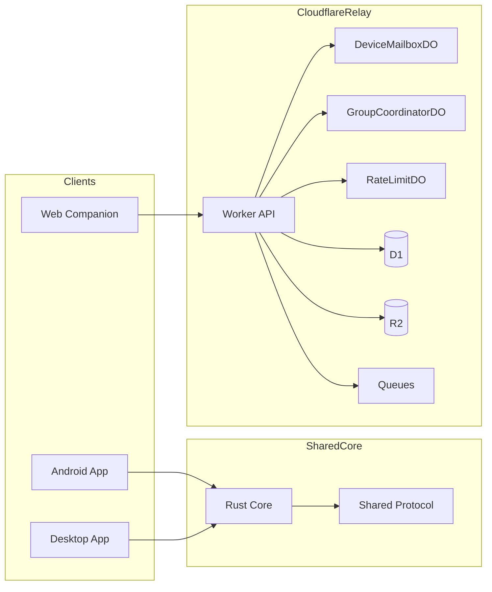
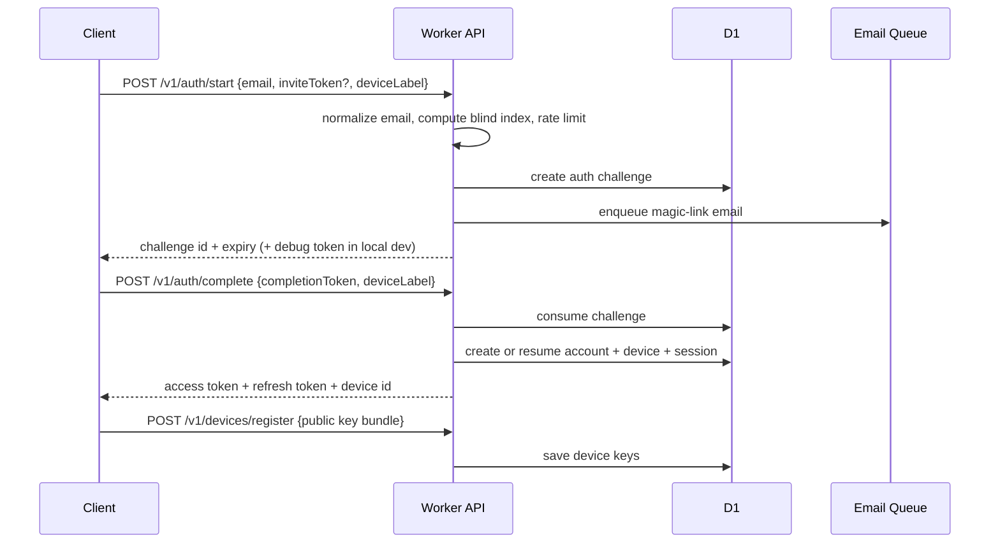
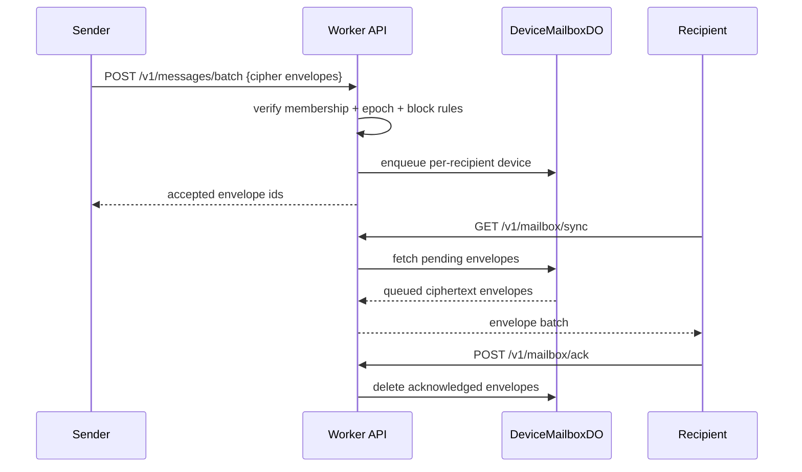

# EmberChamber Beta Architecture

## Runtime Roles

- `apps/mobile`: Android-first beta client with local SQLite and SecureStore
- `apps/desktop`: Windows and Ubuntu Tauri shell with bundled local frontend
- `apps/web`: public site, invite landing, and account bootstrap companion
- `apps/relay`: Cloudflare Worker edge service for auth, relay APIs, attachment tickets, and metadata
- `crates/core`: Rust secure-state and sync engine scaffold
- `crates/relay-protocol` + `packages/protocol`: shared contracts for relay, mailbox, keys, and sessions

## High-Level Diagram

## Auth Flow

## Mailbox Flow

## Data Boundaries

### On device

- decrypted conversation history
- local search index
- private keys
- outbox and retry state
- device safety state

### In relay metadata plane

- blinded email index
- encrypted email ciphertext
- account, device, and session rows
- public identity bundles and prekeys
- conversation membership and epoch
- blocked-account rules
- report disclosures

### In relay transient ciphertext plane

- mailbox ciphertext envelopes in Durable Object storage
- encrypted attachment blobs in R2

## D1 Tables

- `beta_invites`
- `accounts`
- `account_emails`
- `auth_challenges`
- `devices`
- `sessions`
- `passkeys`
- `conversations`
- `conversation_members`
- `conversation_invites`
- `blocks`
- `attachments`
- `reports`
- `device_links`

## Durable Objects

### `DeviceMailboxDO`

- one object per device
- stores pending ciphertext envelopes
- handles sync cursoring and ack deletion
- becomes the natural place to add live WebSocket delivery next

### `GroupCoordinatorDO`

- one object per small group
- tracks current epoch and active members
- coordinates membership rotation without server-readable content

### `RateLimitDO`

- keyed auth and abuse limiter
- isolates invite abuse, auth storms, and send floods

## Desktop Strategy

- Desktop is no longer a remote URL wrapper.
- `apps/desktop/shell/index.html` is bundled locally inside Tauri.
- The next integration step is wiring the desktop shell to the Rust core and relay APIs.

## Mobile Strategy

- Android is the first-class client.
- Expo is used for faster native iteration and Android build generation.
- SecureStore is used for bootstrap secrets and session material.
- SQLite is initialized on-device for local-first state.

## Explicit Non-Goals for Beta

- public discovery
- public channels
- server-side private-message search
- pure P2P operation without any hosted relay
- phone-number identity
- blanket server-side moderation visibility into encrypted content
